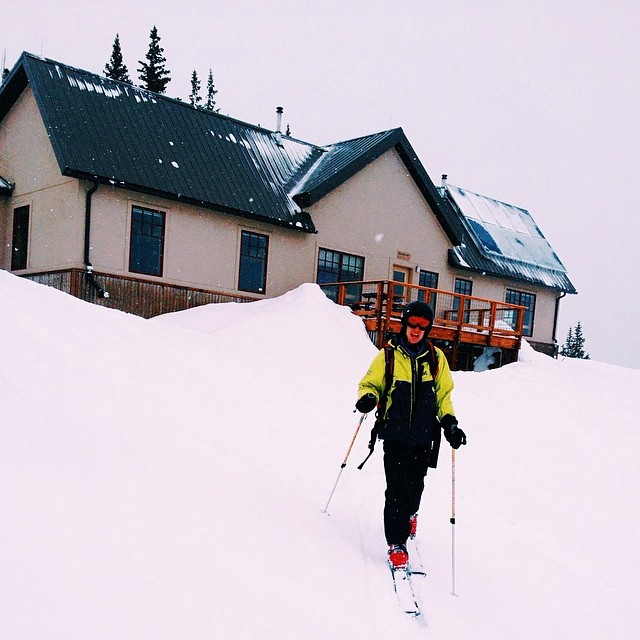
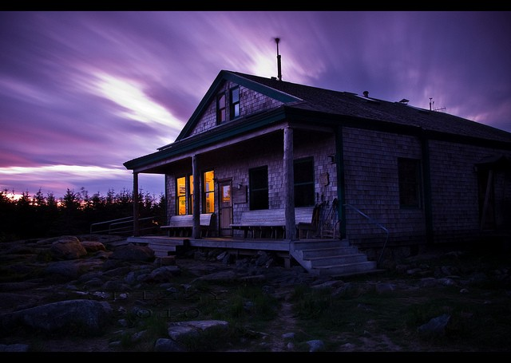

Like most kids fresh out of high school, I had no idea what I wanted to do with my life.

Unlike most kids, I decided to take a gap year to help me figure it out.
This is my story of what I learned along the way.

#### Photo by [Lucas Becker](https://unsplash.com/@lukasbecker)
This article will focus on gap years, but my points apply to taking any break from schooling before deciding to pursue a career or further education.

My senior year was filled with AP classes, college applications, and sports practices. I enjoyed everything I was doing, but it left little time for reflecting on what to do next.

Instead of taking the time to reflect, I subconsciously relied on a heuristic: follow the actions of the people around you. This led me to applying to 8–10 of the best schools I thought I could get into, and eventually choosing one to attend.

Despite being burned out from high school and loads of work, I was pumped for college. Like most 18 year-olds I couldn’t wait to taste that sweet freedom.

Fortunately, my parents encouraged me to defer for a year and take some time to experience the world before diving into more school. I would get the freedom I was craving without all the dedication that comes with college.

It wasn’t too hard to convince me it was the right thing to do.

I worked all summer and into the fall at [Bloom’n Cow](http://www.bloomncowicecream.com/) Ice Cream Shop. I was able to save money for my biggest gap year expense: a trip to Central America with [Carpe Diem Education](https://www.carpediemeducation.org/). After that trip, I went to [Snow Mountain Ranch](http://snowmountainranch.org/) in Colorado to work. They provided me with room, board, a small stipend and a chance to ski at [Winter Park](https://www.winterparkresort.com/) for free. I spent my summer in the white mountains of New Hampshire working at an [Appalachian Mountain Club](https://www.outdoors.org/) (AMC) hut.

Some parts of my gap year sucked. I got so sick in Nicaragua that I had to go to a local hospital. I got robbed at gunpoint in Guatemala. I got depressed working in Colorado cleaning toilets for 8 hours a day.

But most of it was amazing.

I found a passion for cooking. I met people from all over the world. I made lifelong friends and learned so much about myself along the way.

#### Sunset looking out onto Volcano Concepción
## Back To School
Fast forward to the start of my classes the following year. I still had no idea what I wanted to do. Two months into the semester I had to declare my major.

I chose Chemical Engineering out of a vague interest for chemistry and food science. Two years later I can say there is a decent chance that I will never work as a chemical engineer. Many of my classmates have minimal interest in working in the field as well.

Luckily for me, I have found a passion for Computer Science ([article](https://medium.freecodecamp.com/how-doing-something-i-love-landed-me-a-top-tier-tech-internship-fe78d8b74e48#.voi7w59x1)). But I still worry that many of those around me will see no other option than to start a career in an industry that they do not enjoy.

## How Does This Relate to a Gap Year?
Both as students and as parents, we need to start placing more value on spending our life doing things we enjoy. 70% of U.S employees say they hate their job ([source](http://www.medicaldaily.com/i-hate-my-job-say-70-us-employees-how-be-happy-work-319928)).

I believe that a major reason for this is that people do not spend enough time thinking about what they actually want to do.

[Will MacAskill](http://www.williammacaskill.com/) (co-founder of [80,000 hours](https://80000hours.org/)) has talked about this topic extensively. In life, most of us will have around 80,000 working hours. In the long term, it is an incredible investment to spend at least 4000 hours (2 working years) thinking about how to spend the remaining 95% of working hours.

Stop telling your kid that college is a great place to discover your interest. College is expensive and four years goes quickly. If you are like me and many of my classmates, by the time you find your area of interest, it might be too late.

Even though I still was not sure what I wanted to do after I finished my gap year, I do believe it has been hugely influential throughout my college experience, and in helping me find an interest in programming.

#### Telemark Skiing in Colorado

## Working A Crappy Job
I spent forty hours a week in Colorado making beds and cleaning toilets. At the time I hated it, but what I learned about myself in the process has proven invaluable.

As [Casey Neistat](http://jaronschneider.com/blog/2015/5/13/casey-neistat-nails-it-again-why-you-need-to-work-a-crappy-job) has mentioned, working a crappy job can prove extremely valuable. When you spend many hours doing something you hate, you will inevitably start spending some of that time dreaming about what you might like to do instead.

The earlier that you can have this experience in life, the more beneficial it will be.

## What To Do During Your Gap Year
Okay, so you’ve made it this far. Maybe I have even convinced you that taking some time off from school is a good idea. But what the heck are you going to do instead?

#### Making chocolate on a farm on Ometepe Island

**1. Travel:** Read Vagabonding, and you’ll realize travel doesn’t have to be crazy expensive. Spending time in other countries outside your comfort zone is fantastic for self discovery.

**2. Work:** I mentioned this earlier but it’s worth repeating. This can help you fund your travel and other experiences, and I guarantee it will make those experiences more rewarding. Knowing that you worked hard to make a trip happen, will make you so much more grateful during the experience. If you find a job you actually enjoy, awesome. Otherwise, just take whatever you can find. Working a job you hate for a few months won’t kill you.

**3. Learn new skills:** Just because you aren’t enrolled in formal education doesn’t mean you have to stop learning. Start your own blog, attend a coding bootcamp, take courses on Udemy, signup for a cooking class in Thailand. Try stuff out, spend some money, it’s okay to invest in yourself. After all, you’re already saving you and your parents 20,000–60,000 dollars per year by not attending college. Once you find something you love, do it every day and try to improve.

#### Galehead Hut, in the white mountains. Photo by [Scott Disnard](https://www.flickr.com/photos/sdizzy/)

If you do find something you love, you might even find there is no good reason for you go to college. For fields such as marketing, entrepreneurship, and programming, formal education has a very difficult time keeping up with the rapid developments that are constantly happening.

Spend time refining your skills consistently, and you will be well equipped to make a living with this skill. If you are dedicated, this is possible in the same amount of time (if not less) that it would have taken you to get a 4 year degree (and debt free!).

## Closing Thoughts
My goal through writing this article is not to have everyone take a gap year.

We all know people that genuinely do want to be a doctor and have been dreaming about med school since age ten. That being said, I think these type of people are the exception to the rule, rather than the majority.

Instead, I want parents and their kids to see taking time off from education as a fantastic option.

Let’s change the dialog around higher education.

Intentionally taking time away from school after high school should be something that is praised and normal, rather than questioned and weird.

If you are a young adult reading this with no idea what to pursue next, I beg you to take that 5% of your 80,000 working hours to plan. Spend it exploring, trying new things, and asking yourself what areas you want to explore further.

I promise it will be worth it.
