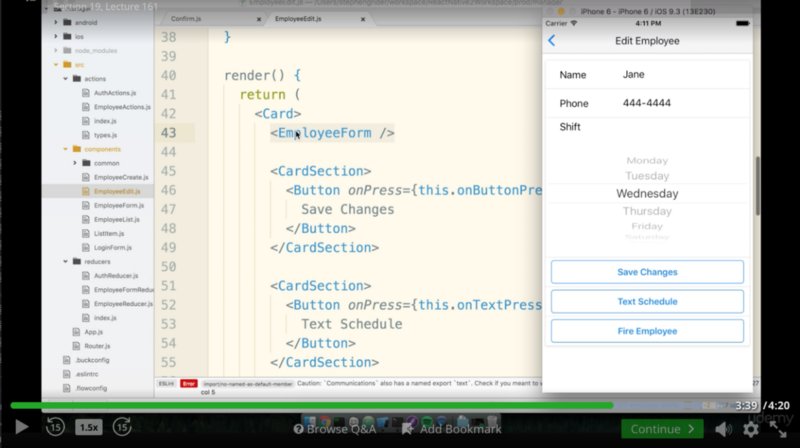
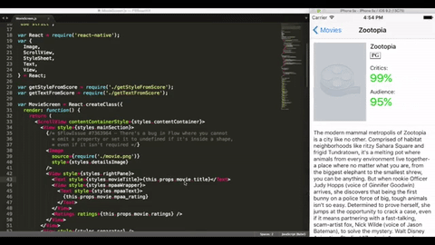

#### Screenshots from the current version of my app

After a few weeks of playing around with React Native, I just came away with my first real mobile app. It’s fairly simple, but it only took me a few days to build and I had a blast doing it.

I created a mobile app for my favorite food blog, [Smitten Kitchen](https://smittenkitchen.com/).

The app allows users to search through a database of over 1,000 recipes, and concisely view the necessary ingredients and directions for each one.

Users can also bookmark recipes and easily share them with a friend.

<iframe src="https://player.vimeo.com/video/216103204" width="640" height="360" frameborder="0" webkitallowfullscreen mozallowfullscreen allowfullscreen></iframe>

I’m still waiting for permission from the blog to publish this app, but you can check out all of the code [here](https://github.com/twmilli/smitten-kitchen). Note that the url for my API has been stubbed for the time being out of respect for Smitten Kitchen.

## React Native isn’t going away any time soon
A common reservation among developers is that they don’t want to invest the time to learn a new technology if there’s a strong chance it will become obsolete in the near future.

Even from my relatively minimal experience with React Native, I’ve found it to be an enormously powerful tool. I am confident it will be used in the years to come.

Facebook, Instagram, and Airbnb all built the latest versions of their mobile apps using React Native. And here’s a [list](https://facebook.github.io/react-native/showcase.html) of the some other popular apps that were built using it.

[Jeff Meyerson](https://medium.com/@jeffmeyerson), creator of the podcast [Software Engineering Daily](https://softwareengineeringdaily.com/2017/04/11/the-future-of-react-native-with-brent-vatne-and-adam-perry/), has talked extensively about the React Native platform. He believes it will survive and continue to capture the majority of the mobile ecosystem.

He has even speculated that Facebook may be creating their own mobile phone, which would be built specifically to support apps made with React Native.

## How React Native is different from other cross-platform tools
If you’re new to [React Native](https://facebook.github.io/react-native/releases/next/), it’s an open source project started by Facebook. It allows developers to build cross-platform mobile apps using JavaScript. It works very similarly to React, Facebook’s popular JavaScript library for building single page web applications.

I’ve always been skeptical of tools that advertise themselves as cross-platform for mobile. All too often you end up with a look, feel, and performance that doesn’t quite match the native platform.

React Native is not like other mobile app development frameworks, such as Ionic or Cordova. Those run inside of a web view, or an “HTML5 app,” or a “hybrid app.”

You build a high performance mobile app that is indistinguishable from one that is built using Swift/Objective-C or Java.

That being said, it is still important to understand the intricacies and differences between platforms. The user experience for Android and iOS are fundamentally different, and you still need to build your app in a way that will feel natural on both platforms.

In addition, if there is ever a feature that you need to add that is not yet supported by the React Native library, React Native makes it easy to write your own [Native Module](https://facebook.github.io/react-native/docs/native-modules-ios.html) in the corresponding language, which can then be linked to your React Native codebase.

## How To Get Started
Personally, I used [this Udemy course](https://www.udemy.com/the-complete-react-native-and-redux-course/) to get started. It served as a nice refresher of react and redux, and was helpful for getting setup.

And recently Facebook released [Create React Native App](https://facebook.github.io/react-native/blog/2017/03/13/introducing-create-react-native-app.html). This tool further simplifies the initial setup process.

#### Working my way through the Udemy Course
If you’re already familiar with React, you can probably dive straight into the [documentation](https://facebook.github.io/react-native/docs/getting-started.html). For only $10 however, the course is a bargain and walks you through the process of making four mobile apps as well as common components that you can reuse in future projects.

Udemy also offers a course covering [Advanced React Native Concepts](https://www.udemy.com/react-native-advanced/), for those already familiar with the platform.

## Styling in React Native
Styling in React Native takes some getting used to. React Native heavily uses CSS flexbox, something that I was not particularly comfortable with, even coming from a web background.

Luckily there are already some fantastic resources to learn about flexbox:

[How flexbox works — explained with big, colorful, animated gifs](https://medium.freecodecamp.com/an-animated-guide-to-flexbox-d280cf6afc35)

[React Native Layout Examples](http://browniefed.com/blog/react-native-layout-examples/)

A fun game to help you practice: [Flexbox Froggy](http://flexboxfroggy.com/)

After working with React Native for a few weeks, I now have a much better understanding of flexbox, which I can apply to my next web project.

The current best practice is to create a styles object for each component, then apply it via inline-styles. Keep in mind that you are not actually writing CSS, so the naming of properties is a little different as well.

Another key difference is that you cannot use HTML tags in your javascript, because you are writing code to run on a phone, rather than in a browser. Instead, components are built with a set of base level components provided by the React Native library.

It takes a little getting used to, but before you know it you’ll find yourself accidentally using a View tag in place of a 

 in your next web app.

To get a better feel for how all of this works, take a peek at the code for a simple button component below.

Here’s the [GitHub gist](https://gist.github.com/twmilli/5d2bace1faa1d04b1d4b5217c553a671#file-button-js).

## Navigation
Navigation is one of the few areas of React Native where there is not a consensus on a clear solution.

React Router has become the standard library of choice for the React community, but there are a number of libraries floating around in the React Native community.

Personally I used the [React Native Router Flux](https://github.com/aksonov/react-native-router-flux) library for my project which worked just fine. But I can see how you might run into some bigger issues on more complex projects.

Luckily, React Native has already developed a massive community. New versions of the project are released every month, so I am confident that issues like navigation will be solved over time.

## Developer Experience Matters
The ability to share code between Android and iOS applications is undoubtedly a draw of React Native, but it is only a small part of what makes the tool so incredible.

My favorite part of using React Native is the ability to reload immediately. I have used Android Studio in the past, and commonly had to deal with 30–60 second build times.

This saves time and I found it easier to get into a [flow state](https://en.wikipedia.org/wiki/Flow_%28psychology%29) without those pesky build times to disrupt me.

#### Hi I’m Taylor. Hot Reloading changed my life. Source: Facebook

React Native makes mobile development fun again, and that alone is enough of a reason to try it out for your next project.

## Be Willing To Explore
React Native is a perfect example of what can happen when we apply ideas that have proven successful in one area of software (web), to a seemingly separate area (mobile).

As [Haseeb Quereshi](https://medium.com/@hosseeb) convincingly argued in his [talk on convergence](https://softwareengineeringdaily.com/2017/02/24/convergence-with-haseeb-qureshi/), as software engineers we should be converging on certain principles, languages and tools that can be successfully applied universally.

#### Source: ThoughtCo

We should want to find what really is the optimal solution.

>“Keep your identity small” — Paul Graham

Often times we become overly dogmatic within a community, which comes at the cost of gaining important insights from outside communities.

Go explore other areas.

If you try out React Native, you’ll see just how awesome the results can be.

_______

Thank you so much for taking the time out of your day to read my article.

If you’d enjoy more detailed articles/tutorials about React Native, click the 💚 below and feel free to leave a comment below.
