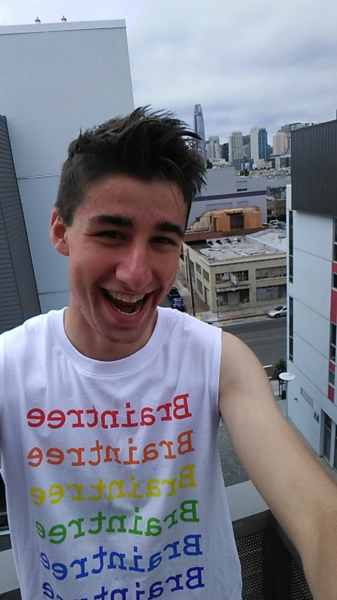
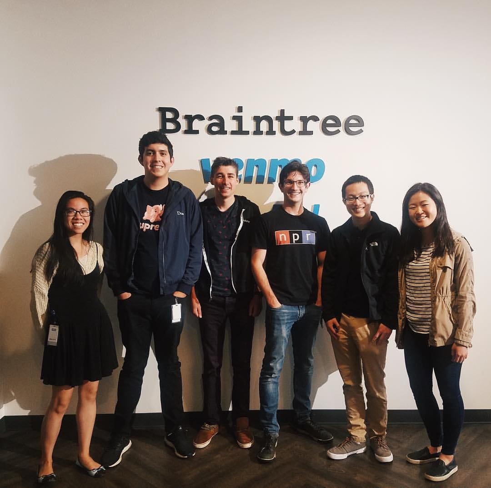
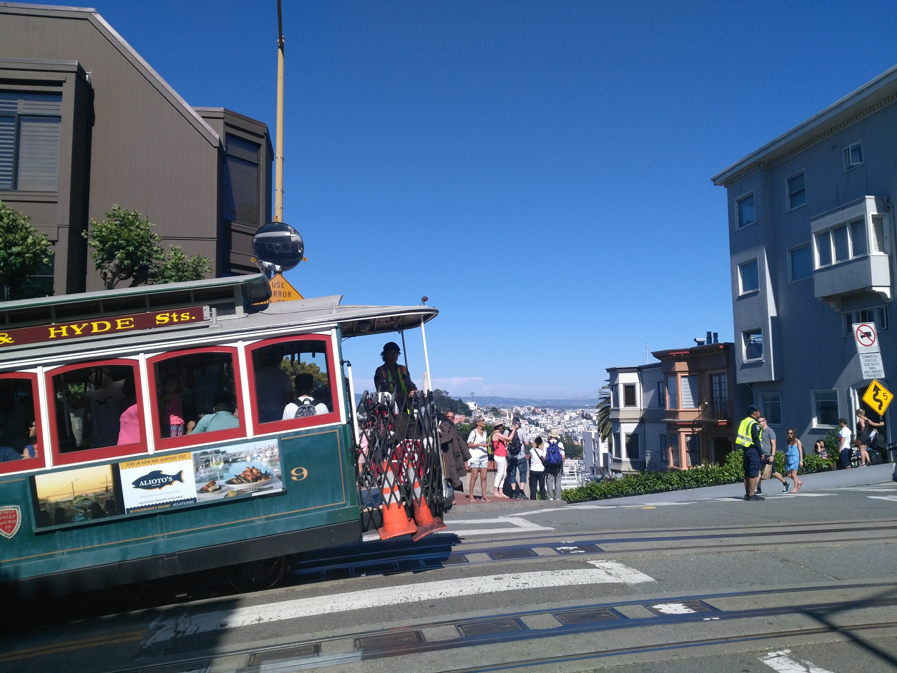

#### Pre Pride Parade selfie

So if you're paying attention, you know that I skipped last weeks blog post.

I know, I know, I said that I would write every week, and here I am already breaking my promise.  But don't worry, I'm back this week to catch you up, but I've decided to break the update up into two posts to keep it digestible.

Stay tuned for a bonus mid-week post this week with plenty of epic pictures from Tahoe.

## Outside of work
It wasn't until I was recapping my week on the phone to my parents that I realized that I had been busy almost every single night after work.

On Tuesday I attended the Inaugural [Hacker Noon](https://hackernoon.com/) Party.

This is part of the magic of San Francisco.  I saw the event advertised on a Hacker Noon article, and a few days later I walked a few blocks to the address, and there it was.

Almost every day I see an interesting event or meetup that I think would be fun to attend.  I don't go to most of them, but there's something intriguing about meeting up with a bunch of strangers brought together by a common interest.

I talked to loads of people there, most notably some current students at [Hack Reactor](http://www.hackreactor.com/?utm_source=googlesearchnetwork&utm_medium=text&utm_campaign=P_Search_BrandOnsite_General&utm_term=hack%20reactor&utm_content=HROS) and [App Academy](https://www.appacademy.io/), two of the most selective coding boot camps in San Francisco.

I've heard a lot of mixed opinions about coding bootcamps, so it was satisfying to be able to hear directly from people that have gone through the experience.

I'm super interested in alternative methods of education and the edtech industry.  It's absolutely an area that I think needs and will continue to grow in the coming years.

The diversity amongst the bootcamp students that I met was also fascinating.

There was a 19 year-old that had lived a semi-nomadic lifestyle after graduating high school.  He visited almost every state in the U.S, and paid for it mainly through street piano performances.

At some point he figured out that he could hack together websites as freelance work to generate a little extra income on the side.  He ended up getting super into it, coming to San Francisco, and getting accepted to Hack Reactor.

I met a guy in his mid 30s that had a PhD in neurobiology.  He told me he wanted to learn to code so that he could pursue his dream of working on Elon Musk's Neuralink.

People of all types are learning to code for all kinds of reasons.

If it's something you have an interest in, you don't have to drop everything and enroll in a bootcamp.  A few hours a week is a great place to start.  Every day is a great place to start.

If you're not sure where to start, or you're feeling stuck in your journey, feel free to reach out to me (twm013@bucknell.edu).

## Internapalooza

Wednesday night was internapalooza.

For the most part, the event was a good reminder of the fact that networking events, especially those made up of ~8,000 interns are not actually a great place to "network".

That being said, the event was still a good opportunity to chat with recruiters and engineers at top tech companies that don't come to recruit at Bucknell.

I also enjoyed the anecdote shared by [Drew Houston](https://en.wikipedia.org/wiki/Drew_Houston), CEO of dropbox.

When he was in college living in a Fraternity house, they had a constant problem of people leaving dirty dishes in the sink.  One day after a meal, him and his friend went to wash their dishes (like any well-behaved frat bro should).

Without saying anything, his friend picked up a few dirty dishes, washed them, and continued on.

"You don't have to wash those" he told his friend.  It wasn't fair that he should wash someone else's dishes because they had left them in the sink out of negligence.

Later, he thought back on the moment and realized maybe he had been thinking about it wrong.  Since then, "washing the dishes" has become a guiding principal for various facets of his life.

Sometimes the best way to solve a problem is to take a little extra time, and do it yourself.  

In terms of work, I love this mantra.  If you see a reoccurring problem, you don't need to figure out who is responsible for it, or ask permission, you just need to care enough to solve it.  That in and of itself is valuable.

The world could get a lot better if we all picked up a few extra dirty dishes.

On Thursday, I did my first escape room as part of a Braintree intern event.

It's pretty insane the experience that the owners of [Reason](https://www.tryreason.com/) have been able to create.  I would definitely recommend checking if out if you're with a big group and appreciate puzzles and cool technologies.

    <video width="99%" height="540" autoplay loop muted markdown="0">
        <source src="./reason_video.mp4" type="video/mp4" markdown="0" >
    </video>

#### Post Escape Room Victory Dance

We solved it, but admittedly about a minute or two over the 80 minute time limit.

On Friday I grabbed dinner at [Spinnerie](http://spinnerie.com/) with Jeff Meyerson, host of [Software Engineering Daily](https://softwareengineeringdaily.com/), my favorite podcast for keeping up with software and technology.

It was a little awkward at first, but before I knew it we were engrossed in conversations about education, cryptocurrency, advertising, the future of podcasts, and so much more.

It was pretty cool getting to meet the person who has produced literally hundreds of hours of content that helped me get the internship at Braintree and to where I am today.

Thanks Jeff, for continuing to put out a plethora of great content.

Pride parade was also on Sunday which was quite the experience.  I walked with PayPal/Braintree/Venmo and then walked to Dolores park with a few of my fellow interns (shoutout to Maggie and Sasha).

We hit up bi-rite creamery again (which was equally amazing as the first time), and hung out at the park for a bit.

The fact that a scene like Dolores park even exists is hard to believe until you see it for yourself.  I wish I had taken some pictures to document it.  We had no idea what we were walking into.  Hundreds (thousands?) of people were there partying the entire day.

I don't think we quite got the "full" experience, but I will say that the people watching was pretty entertaining.

## Work
Coming into work every day is still fun, which honestly is not something that I expected.

Every day my pair and I share a fun fact with each other, and then get to work.  The only parts I haven't learned to enjoy are pieces of the manual deploy process, and Kafka integration testing...(don't ask, just trust me on this one).

My Vim/Tmux skills are still well below where they need to be, but I have reached a basic level of proficiency.  At this point I'm fully converted to the way Braintree does things.

Vim is ridiculously powerful.  I swear every day my pair pulls out of new trick that I didn't know existed or saves 20 minutes of work with a single line of regex sorcery.  He's inspired me to work on my regex skills.  [Regex Crossword](https://regexcrossword.com/) is his personal recommendation for getting to his level (one can dream).

#### The Intern Crew

Now that I am officially halfway through my internship, I have been working on taking more ownership of my work.  It's easier to let my pair take the lead on everything, but I know the only way to get closer to his level is to take the lead on certain tasks and get comfortable working independently at times.

It's helpful to remember that most of the time my pair has just as little background knowledge in whatever problem we're working on as I do, he's just gotten really good at teaching himself how to quickly figure it out.

In terms of development skills, I still lack a lot of general rails knowledge, but I have gotten a lot more comfortable working in Ruby, in part by spending a little extra time outside of work reading articles and watching some interesting conference talks.

Here's a few of my favorites:
* [Lies, Damned Lies, and Substrings by Haseeb Qureshi](https://www.youtube.com/watch?v=piLmdh3Am3o)
* [My Meta Moments by John Dewyze](https://www.youtube.com/watch?v=piLmdh3Am3o)
* [Perusing the Rails Source Code - A Beginners Guide by Alex Kitchens](https://www.youtube.com/watch?v=Q_MpGRfnY5s)

I've also been thinking a lot about company culture recently, something that first-time founders often completely overlook.  If you look at all of the top tech companies: Netflix, Google, Amazon, Facebook, etc..., they all have a unique but very intentional culture.

Braintree is no different.

It's hard to convey exactly what the culture is here, but there is definitely a lot of value placed on open communication feedback, and openness.

Braintree also hires a lot of developers that did not formally study computer science in college and were largely self taught to begin their career.  It's not uncommon to work with a philosophy or bio major (among others).  It makes for a really dynamic and fun mix of people.

It's an important factor as I start to think about what I might like to work next year.

___
Thanks for taking the time out of your day to give this a read, it really does mean a lot to me. Remember to check back in for a post on Wednesday to hear about Tahoe, Interview Prep and a 4th of July in San Francisco!
