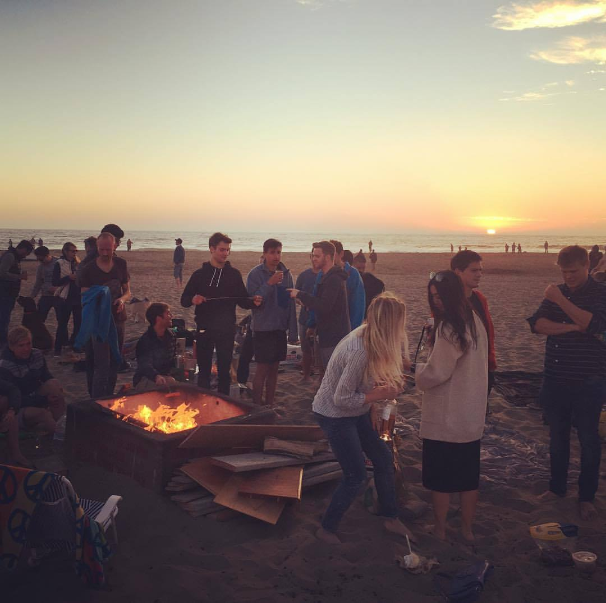
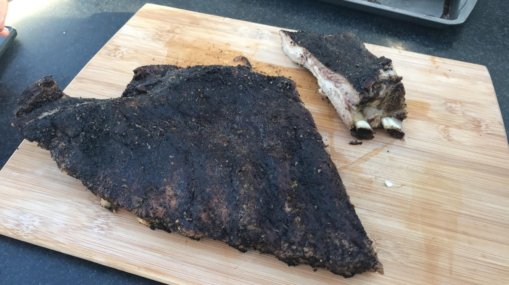
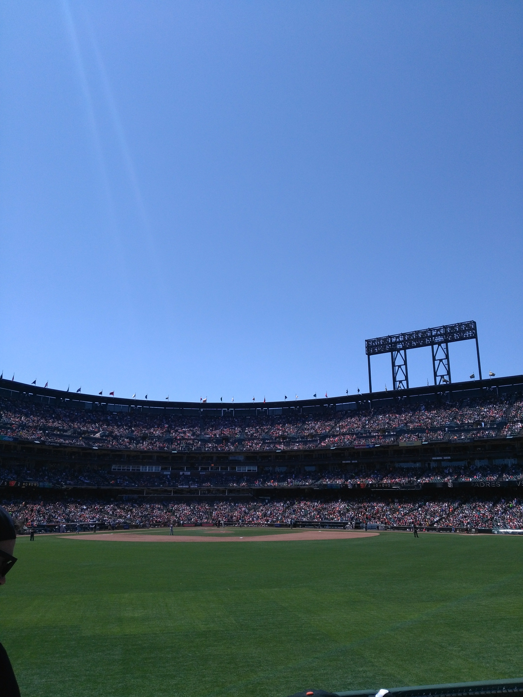

It's wild to think that in two weeks, my internship will be over, and I'll be getting ready to fly home for a few days before starting my senior year at Bucknell.

One of my favorite things about blogging this summer, is the chance it gives you to step back and reflect on how you've been using your time over the past week.

Unfortunately (or fortunately), this also makes you acutely aware of all the things you wanted to do, but just haven't found the time for.

I haven't recorded that podcast episode that I wanted to.  I haven't home cured any meat.  I haven't done as much interview prep as I said I would.  And I'm okay with that.

This week for the first time in awhile, I started to feel a little run down.  I stay pretty busy here.  My mindset for the summer has pretty much been, "I'll sleep in September".  But this week for whatever reason, I started to feel the effects of always doing.  Sometimes the best cure for this is to take it easy for a few days and just go to sleep early as I did this week.

But pushing from the other side of this, it's important to understand that if you're like me, you're never going to not be "busy".  This is a fact of life.  There will always be an effectively unlimited  list of things you need or want to do, and a limited time to do them.

If you find yourself telling yourself, "I really want to do x, but I'm going to wait until y is finished before starting", it's almost certainly a fallacy.

I could tell you the reasons I haven't made a podcast episode, but ultimately they're just excuses.  I could tell you I'm waiting until my internship finishes to devote more time to writing, but the truth is I'll be just as busy (if not more) with other things as soon as school starts.

If you're feeling overwhelmed or run down, sometimes you need to take a step back and give yourself a break.

Other times, maybe you just need to embrace it.  Being busy is too easy of an excuse not to do something you genuinely want to do.  There will probably never be a perfect time to start a blog, or a side business, or learn to code.

So why wait?  You can start today.

## Unconventional Career Advice
Working my first real 9-5 job this summer has forced me to think about my career and what I want to do next year.  I've been thinking about it a lot.  Naturally, I talk to other people about it as well.

Recently someone said something that really resonated with me:
>"Whether public company or startup doesn't really matter, how much they pay doesn't really matter, almost nothing matters but how well your first job is going to set you up for the future".

Salary, perks, prestige of company, etc. are all distractions.  As long as you continue to grow and learn, any money that you make now will be dwarfed by what you will make later in your career.

> "Most people overestimate what they can do in one year and underestimate what they can do in ten years." - Bill Gates

To my fellow seniors thinking about working in tech, I think it's worth questioning if Google and Facebook should really be considered the most desirable companies to work at.

Ask yourself why you want to work there.  If it's mostly about salaries and prestige, that's okay, but understand that by choosing to work there, you might be getting these things in the short term only to give them up in the long term.

I'm not saying these are bad places to work, but I do think there is a real danger of working for a big company, not being able to move fast, and as a result not learning as fast as you could in some of the prime years of your life.

How do you think about where you want to work?  I'm always open to conflicting opinions and I'd love to here your thoughts.

___

Although I did spend a lot of time sleeping this week, I still fit in a little fun as well.

#### Fireworks on Ocean Beach

Yesterday I took my first dip in the Pacific ocean of the summer yesterday at ocean beach.  We followed it up with hot dogs, S'mores, and impromptu illegal fireworks.

#### Ribs with the Roomies

Today I hit up a Giants day game with some Bucknell friends (Hey Chachi, Tegan, and Vicki).  They lost but it was a fun, relaxing outing nonetheless.

#### AT&T Park

## Reading & Podcasts
Here's a few of the pieces I've enjoyed over the past week:

* [A hacker stole $31M of Ether—how it happened and what it means for Ethereum](http://haseebq.com/a-hacker-stole-31m-of-ether/).  This is a fantastic piece about cryptocurrency as a whole, but especially the vulnerability that was found recently which caused cryptocurrency values to plummet.  I love Haseeb's writing because he has a knack for going very deep into a subject, while still making the article remarkably easy to understand

* [What is not going to change in the next 10 years?](http://gonen.blog/what-is-not-going-to-change-in-the-next-10-years).  Jordan Gonen is a fellow bay area intern who has been writing every day for over 500 days.  I love this short piece because it examines a question that not many people are asking, but is clearly important.

* [Coinbase Security with Philip Martin](https://softwareengineeringdaily.com/2017/07/14/coinbase-security-with-philip-martin/).  The entire [Coinbase](https://www.coinbase.com/?r=56af74e3d4a3e711aa00013f) series on SEDaily was fantastic not only for diving deep into what kinds of problems Coinbase is trying to solve, but also for learning more about crypto and what the future could hold.  This particular episode also touches on some of the serious issues that the web as a whole is dealing with, which will only continue to grow more prevalent in the coming years.

* [Machine learning has entered the kitchen, and I for one welcome our AI culinary overlords
](https://thenextweb.com/artificial-intelligence/2017/07/20/machine-learning-has-entered-the-kitchen-and-i-for-one-welcome-our-ai-culinary-overlords/#.tnw_sWY0OZuH).  A few days ago MIT announced it had created an artificial intelligence program that could look at a picture of a food item — like a cookie and tell you the ingredients used to make it.  That's pretty cool.

It's also worth noting that [my React Native](https://medium.freecodecamp.org/after-building-my-first-react-native-app-im-now-convinced-it-s-the-future-d3c5e74f8fa8) article got chosen by a Medium Publication as one of the top 10 React articles for the month!  You can checkout the full list [here](https://medium.mybridge.co/react-js-top-10-articles-for-the-past-month-v-july-2017-f7f0696dfa76).

____

That's all for this week.  Thanks for being here.
