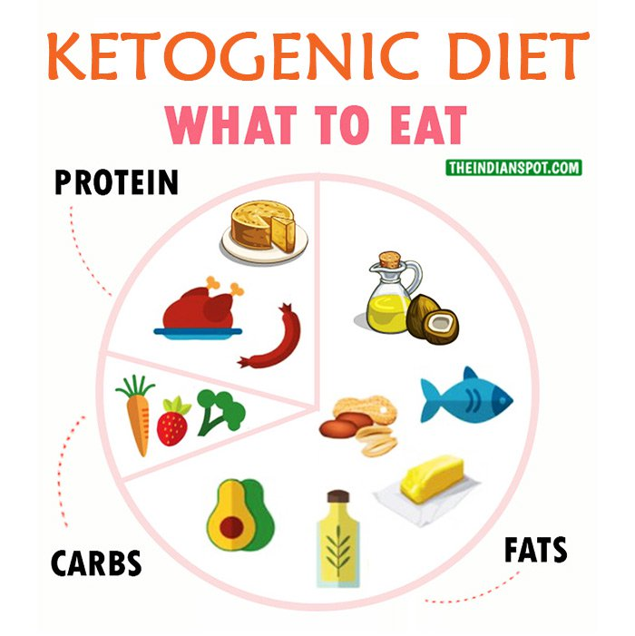

The Prohibition era in the United States is a notorious example of unintended consequences.  The idea of a ban on alcohol sounded good in theory.

Supporters expected economic growth in other areas such as clothing and entertainment as Americans looked for new ways to entertain themselves.  But none of these things ever happened.  Instead - most of these things actually declined while the government missed out on a massive amount of revenue from liquor taxes.

Statistics from the time period are unreliable, but it seems clear that in many periods of the U.S, drinking levels actually increased ([source](http://www.pbs.org/kenburns/prohibition/unintended-consequences/))

Prohibition is a lesson in 2nd order effects.  Effects that might seem obvious in hindsight but probably difficult to predict beforehand.

With a lot of highly restrictive diets gaining popularity as Paleo, Ketogenic, Autoimmune, I can't help but worry about some of the 2nd order of the effects at play.  Personally, I'm a believer in the power of a lot of these type of diets.  I've read a lot of the studies and the logic makes sense to me.  We probably all know people for whom these type of diets have been transformative.

But these diets come at a cost.  They have 2nd order effects.  When you say no to tea time and a scone with your mom because the scone has gluten in it, you're changing your relationship with your mom.  Even if you go to tea time and don't eat a scone - it still changes things.

Maybe your new diet also means that you subconsciously don't go out to eat as much with friends and your relationships suffer a bit.  Or maybe you spend so much more time buying, preparing, and thinking about food that you have less time for play.

Or maybe now your relationship with food is worse because you've clearly defined what "good" and "bad" foods are.

I don't know what your 2nd order effects are.  But denying their existence is naive. Food is important. Food is all around us. Food is culture. Food is a way to connect with others.

Now I would never criticize someone for experimenting with their diet and trying to improve their health.  It's a noble goal and running self-experiments can be quite fun. For some people, the improvements to health and wellbeing will outweigh these 2nd order downsides.

But too often we have a tendency to blindly follow a regiment that sounds good in theory, without considering the side effects.  Could you get most of the benefits without being as strict and reduce 2nd order effects at the same time?  People on the internet would probably say no. Extremism sells. Creating a cult of Paleo diet believers is effective.  But it's worth considering...